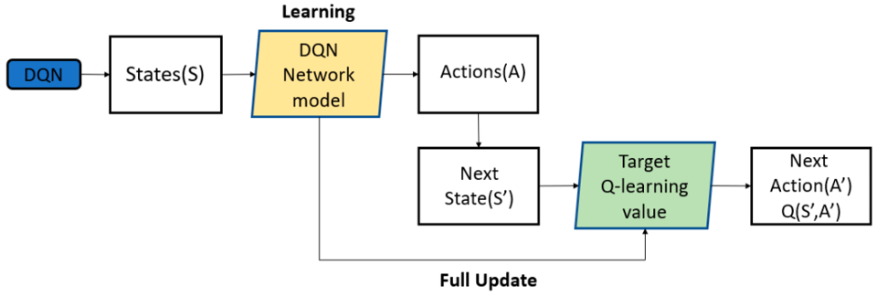

# Project Description

The primary objective of this project is to leverage the lunar lander gymnasium environment with current python reinforcement learning libraries to get a greater understanding in the machine learning process using a Deep Q Network.

## Basic Overview of Deep Q Networks



Deep Q Networks (DQN), are a type of neural network architecture used in reinforcement learning, specifically in the context of Q-learning. The goal of a DQN is to approximate the optimal action-value function, denoted as Q(s, a), which represents the expected cumulative reward of taking action 'a' in state 's' and following the optimal policy thereafter.

Input Layer (State Representation): The input layer receives the state information as input. This could be a pixel-based representation of the environment in the case of image-based tasks, or a feature vector describing the state.

Hidden Layers (Deep Layers): DQN often employs a deep neural network with multiple hidden layers. These layers capture complex and hierarchical features in the input data. The use of deep layers allows the network to learn intricate patterns and representations, which is especially beneficial for handling complex environments.
Rectified Linear Units (ReLU): Rectified Linear Units are commonly used as activation functions in the hidden layers. They introduce non-linearity to the network, enabling it to learn and represent complex relationships in the data.

Output Layer (Action Values): The output layer represents the Q-values for each possible action in the given state. The Q-values are estimates of the expected cumulative rewards for each action. The action with the highest Q-value is considered the optimal action in that state.

Experience Replay Buffer: DQN often incorporates an experience replay buffer. This buffer stores past experiences (state, action, reward, next state) to break the temporal correlation in the data. During training, random batches of experiences are sampled from the replay buffer, allowing for more stable and efficient learning.
Target Q-Network: To enhance the stability of training, DQN employs a target Q-network. This is essentially a copy of the main Q-network that is periodically updated to match the current Q-network's parameters. It helps stabilize the training process by providing more consistent targets during the learning updates.
Loss Function: The loss function used in DQN is typically the mean squared error between the predicted Q-values and the target Q-values. The target Q-values are computed based on the Bellman equation, incorporating the reward and the maximum Q-value of the next state.

 is 840 at a value of 271.7456338227941/envRender.gif>)
 is 840 at a value of 271.7456338227941/plots.gif>)


# Quick Start Guide

Disclaimer: guide is written for Ubuntu 22.04 LTS. A Linux Distro. This might not work with a Windows machine.

Lets start by cloning the github. Enter your home directory or location of choice and run the following command, or get a new clone link from the top.
```bash
git clone https://github.com/thulsonASU/RL-Lunar-Lander-Gym.git
# This will generate an https version of the repo
cd RL-Lunar-Lander-Gym # to enter the workspace
```

Proven to work on Ubuntu 22.04 LTS. Create a .venv for installing Python libraries. To begin setup your IDE of choice, This github was created using Visual Studio Code. Create a python virtual env inside your workspace, a workspace would be for example the git that was cloned, using either Visual Studio Codes built in methods or by running ```python -m virtualenv .venv``` All commands are operating system dependant and/or based on your python install. Once you have an environment installed source it in bash, I am assuming you are running Linux Ubunu, ```source .venv/bin/activate```

Enter the workspace/src and run pip install for the requirements file inside the python virtual environment.
```bash
# will go through the requirements.txt and install (cd to src to run)
pip install -r requirements.txt

# Please note, inorder to generate plots and compress them you will need gifsicle, a Linux gif software, install using apt pkgs
sudo apt update
sudo apt-get install gifsicle
```

You should be good to run the ray_lander.py file in your favorite IDE of choice. Otherwise you can run it from command line with,
```bash
# Assuming you are in the file directory
python3 ray_lander.py
```

# Project Reasources and Guides

TensorFlow Agents. "Introduction to Reinforcement Learning." TensorFlow, Available: https://www.tensorflow.org/agents/tutorials/0_intro_rl. Accessed: Dec. 4, 2023.

Farama Foundation, "Gymnasium." PyPI, 2023. Available: https://pypi.org/project/package-name/. Accessed: Dec. 4, 2023. DOI: https://doi.org/10.5281/zenodo.8127025

V. Bons, "Deep Q-Learning for Lunar Lander." Available: https://wingedsheep.com/lunar-lander-dqn/. Accessed: Dec. 4, 2023.

A. Batilo, "An Actually Runnable March 2023 Tutorial." Slice of Experiments, Available: https://www.sliceofexperiments.com/p/an-actually-runnable-march-2023-tutorial. Accessed: Dec. 4, 2023.

W. Heeswijk, "The Four Policy Classes of Reinforcement Learning."Towards Data Science,  Available: https://towardsdatascience.com/the-four-policy-classes-of-reinforcement-learning-38185daa6c8a#:~:text=Policies%20in%20Reinforcement%20Learning. Accessed: Dec. 4, 2023.

J.-H. Park, K. Farkhodov, S.-H. Lee, and K.-R. Kwon, "Deep Reinforcement Learning-Based DQN Agent Algorithm for Visual Object Tracking in a Virtual Environment Simulation" Applied Sciences, vol. 12, no. 7, p. 3220, Mar. 2022,  DOI: 10.3390/app12073220.


## Primary Maintainers
[Tyler Hulson](https://github.com/thulsonASU) <br/>
[Samir Strasser](https://github.com/samir-strasser)
## Contributors
[Zane Reynolds](https://github.com/zdreynol)<br/>
[Sai Srinivas Tatwik Meesala](https://github.com/Tatwik19)<br/>
[Keshav Anand Kabra](https://github.com/keshavkabra1521)


